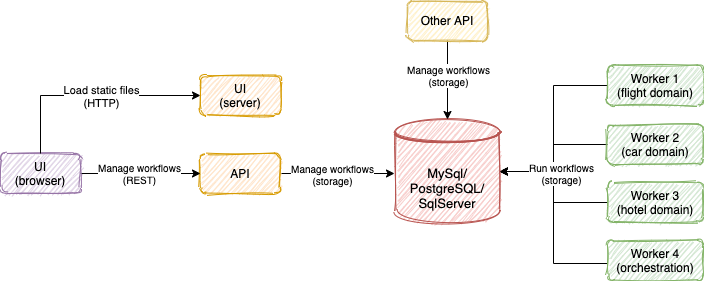

# Durable Task Extensions  

**NOTE:** WORK IN PROGRESS, NOT PRODUCTION READY.

## Introduction

[Durable Task Framework](https://github.com/Azure/durabletask) is an open source framework that provides a foundation for workflow as code in .NET platform.

This project aims to extend it with:
- .NET Dependency Injection and Hosting integration  
- Administrative and monitoring UI
- EFCore storage with support for InMemory, MySQL, PostgreSQL, SQL Server and some [extra features](./src/LLL.DurableTask.EFCore/README.md#features).
- Storage delegation via GRPC protocol

### Related projects

#### [Azure Durable Functions](https://docs.microsoft.com/en-us/azure/azure-functions/durable/durable-functions-overview)

Builds on top of Durable Task Framework and delivers a workflow as code product focused on a user friendliness, multi-language support, serverless and Azure.

#### [Cadence](https://cadenceworkflow.io/) and [Temporal](https://temporal.io/)

Cadence is a scalable and reliable workflow as code platform built an used by Uber. It is heavily inspired on Durable Functions, but also includes some addicional features like [tasks lists](https://cadenceworkflow.io/docs/concepts/task-lists/) and a [monitoring UI](https://github.com/uber/cadence-web). Cadence features are used as inspiration for this project.

Temporal is a fork of Cadence backed by a company with the same name and founded by the original creators of Cadence. It is under active development and might end up officially supporting .NET clients.

## Components

| Name (click for readme) | Package | Description |
| - | - | - |
| [LLL.DurableTask.Client](src/LLL.DurableTask.Client) |  | DI extensions to configure TaskHubClient. |
| [LLL.DurableTask.Worker](src/LLL.DurableTask.Worker) |  | DI extensions to configure TaskHubWorker. |
| [LLL.DurableTask.Api](src/LLL.DurableTask.Api) |  | Exposes TaskHubClient operations as REST API. |
| [LLL.DurableTask.Ui](src/LLL.DurableTask.Ui) |  | UI to monitor and manage orchestrations. |
| [LLL.DurableTask.Server](src/LLL.DurableTask.Server) |  | Expose storage as API. |
| &nbsp;&nbsp;[LLL.DurableTask.Server.Grpc](src/LLL.DurableTask.Server.Grpc) |  | GRPC endpoints for server. |
| &nbsp;&nbsp;[LLL.DurableTask.Server.Grpc.Client](src/LLL.DurableTask.Server.Grpc.Client) |  | Storage implementation using server GRPC endpoints. |
| [LLL.DurableTask.AzureStorage](src/LLL.DurableTask.AzureStorage) |  | Dependency injection for [Azure Storage](https://github.com/Azure/durabletask/tree/main/src/DurableTask.AzureStorage) |
| [LLL.DurableTask.EFCore](src/LLL.DurableTask.EFCore) |  | EFCore relational database storage implementation with [extra features](./src/LLL.DurableTask.EFCore/README.md#features). |
| &nbsp;&nbsp;[LLL.DurableTask.EFCore.InMemory](src/LLL.DurableTask.EFCore.InMemory) |  | EFCore storage InMemory support. |
| &nbsp;&nbsp;[LLL.DurableTask.EFCore.MySql](src/LLL.DurableTask.EFCore.MySql) |  | EFCore storage MySql support. |
| &nbsp;&nbsp;[LLL.DurableTask.EFCore.PostgreSQL](src/LLL.DurableTask.EFCore.PostgreSQL) |  | EFCore storage PostgreSQL support. |
| &nbsp;&nbsp;[LLL.DurableTask.EFCore.SqlServer](src/LLL.DurableTask.EFCore.SqlServer) |  | EFCore storage Sql Server support. |

### Composability

Our components were designed to be independent and highly composable. See below some possible architectures.

#### Microservices with server

#### Microservices with direct storage connection

#### Single service

#### UI for Durable Functions

## Sample

See [samples](samples) for an implementation of the classic book Flight, Car, Hotel with compensation problem using all componentes from above.
