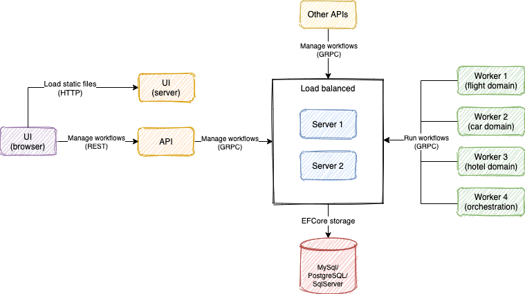

# Durable Task Extensions  

**NOTE:** WORK IN PROGRESS, NOT PRODUCTION READY.

## Introduction

This project aims to extend [Durable Task Framework](https://github.com/Azure/durabletask) with more features and make it easier to use.

### Context

[Durable Task Framework](https://github.com/Azure/durabletask) is an open source framework that provides a foundation for workflow as code in .NET platform.

[Azure Durable Functions](https://docs.microsoft.com/en-us/azure/azure-functions/durable/durable-functions-overview) connects Durable Task Framework to Azure serverless platform, making it simpler to create workflows as code.

The concepts of Durable Functions led to the development of [Cadence](https://cadenceworkflow.io/). A platform that brings Durable Functions to other programming languages and extends it with concepts for better microservices orchestration, like tasks lists and distributed workers.

Because of the bad integration of Cadence with .NET platform, I decided to try to add to Durable Task Framework the features I like from Cadence.

NOTE: Cadence was recently forked by one of it's creators and [Temporal](https://temporal.io/) was created, backed by a company focused on evolving the platform. That might change this landscape in a short term.

## Components

| Name (click for readme) | Package | Description |
| - | - | - |
| [LLL.DurableTask.Client](src/LLL.DurableTask.Client) |  | DI extensions to configure TaskHubClient. |
| [LLL.DurableTask.Worker](src/LLL.DurableTask.Worker) |  | DI extensions to configure TaskHubWorker. |
| [LLL.DurableTask.Api](src/LLL.DurableTask.Api) |  | Exposes TaskHubClient operations as REST API. |
| [LLL.DurableTask.Ui](src/LLL.DurableTask.Ui) |  | UI to monitor and manage orchestrations. |
| [LLL.DurableTask.Server](src/LLL.DurableTask.Server) |  | Expose storage as API. |
| &nbsp;&nbsp;[LLL.DurableTask.Server.Grpc](src/LLL.DurableTask.Server.Grpc) |  | GRPC endpoints for server. |
| &nbsp;&nbsp;[LLL.DurableTask.Server.Grpc.Client](src/LLL.DurableTask.Server.Grpc.Client) |  | Storage implementation using server GRPC endpoints. |
| [LLL.DurableTask.AzureStorage](src/LLL.DurableTask.AzureStorage) |  | Dependency injection for [Azure Storage](https://github.com/Azure/durabletask/tree/main/src/DurableTask.AzureStorage) |
| [LLL.DurableTask.EFCore](src/LLL.DurableTask.EFCore) |  | EFCore relational database storage implementation with [extra features](./src/LLL.DurableTask.EFCore/README.md#features). |
| &nbsp;&nbsp;[LLL.DurableTask.EFCore.InMemory](src/LLL.DurableTask.EFCore.InMemory) |  | EFCore storage InMemory support. |
| &nbsp;&nbsp;[LLL.DurableTask.EFCore.MySql](src/LLL.DurableTask.EFCore.MySql) |  | EFCore storage MySql support. |
| &nbsp;&nbsp;[LLL.DurableTask.EFCore.PostgreSQL](src/LLL.DurableTask.EFCore.PostgreSQL) |  | EFCore storage PostgreSQL support. |
| &nbsp;&nbsp;[LLL.DurableTask.EFCore.SqlServer](src/LLL.DurableTask.EFCore.SqlServer) |  | EFCore storage Sql Server support. |

### Composability

Our components were designed to be independent and highly composable. See below some possible architectures.

#### Microservices with server

#### Microservices with direct storage connection

#### Single service

#### UI for Durable Functions

## Sample

See [samples](samples) for an implementation of the classic book Flight, Car, Hotel with compensation problem using all componentes from above.